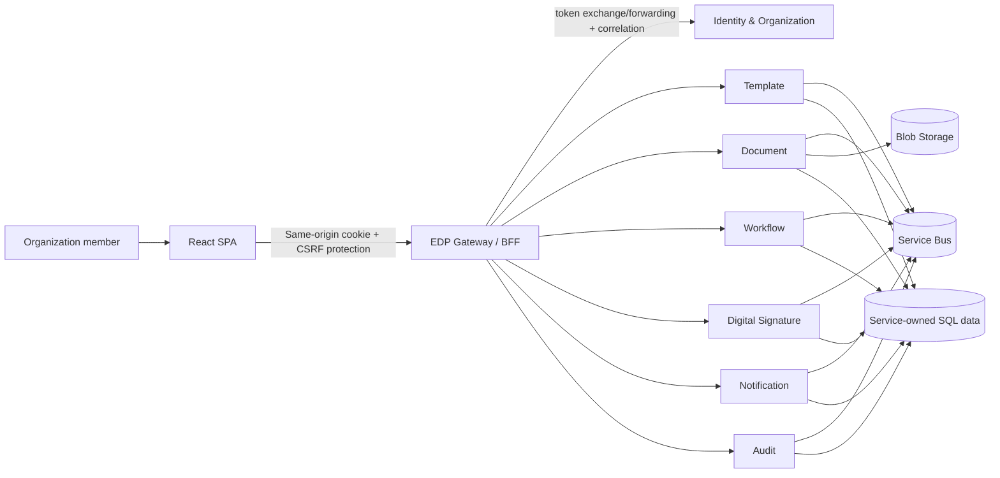

# Phase 10 — UX, UI, Gateway Integration, and MVP Production Readiness

**Project:** Enterprise Document Platform (EDP)  
**Phase:** 10 — final MVP phase  
**Status:** Implementation specification  
**Primary outcome:** replace the existing React placeholders with a secure, accessible, production-ready web application that performs the complete document lifecycle through the Gateway, while closing the specific backend and operational gaps that currently prevent a safe browser-to-service experience.

---

## 1. Agent instructions and non-negotiable outcome

This document is the implementation context for an LLM or engineering team. Implement it in order. Inspect the live API contracts and existing tests before changing a contract; this document identifies the required product behavior, but source/OpenAPI is authoritative for field names until the contract consolidation task is completed.

Do **not** create a second product, a direct-to-service browser client, a mock-only UI, or a separate authentication model. The final flow is:

```text
Browser (React SPA)
  -> same-origin HTTPS Gateway / BFF
  -> authenticated, authorized, organization-scoped service API
  -> service-owned databases, Blob Storage, Service Bus, providers
```

The MVP is complete only when an authorized user can select an organization, create and activate a template, generate and download a document, submit/approve a workflow, manage a signing request, read notifications and audit history, and see clear progress, errors, and permission boundaries in the web application.

### Product boundaries

EDP is a multi-tenant enterprise document-automation product. It owns template management, document generation and storage, workflow approval, digital signing, notification delivery/inbox, and immutable audit visibility. The UI is an operations product for authenticated organization members; it is not a public document-signing portal and it must never expose storage credentials, downstream URLs, Entra access tokens, or cross-organization data.

### Existing baseline observed in this repository

| Area | Present | Phase 10 implication |
| --- | --- | --- |
| Web app | Vite, React 19, TypeScript, React Router 8, Tailwind 4, Gateway cookie login | Keep this stack; replace placeholder pages rather than scaffolding a new app. |
| Authentication | Gateway BFF login/logout/current-user endpoints using an HttpOnly cookie | Browser must communicate only with `/bff` and `/api` on the Gateway origin. |
| Business services | Template, Document, Workflow, Digital Signature, Notification, Audit, Identity, Organization, Storage projects | Build UI capability by capability, then expose each needed route through the Gateway. |
| Gateway | Auth, health, correlation, security headers, rate limiting and downstream `HttpClient` registration | It has **no reverse-proxy/BFF business routes** today. This is a release blocker, not a front-end configuration issue. |
| React pages | Login plus navigation/layout; organizations, templates, documents, workflows, approvals and audit are placeholders | Implement these pages and add Dashboard, Notifications, Signing, Settings/organization context and error states. |

---

## 2. Architecture to implement



### Required ownership rules

- React owns presentation, local form state, client-side validation for usability, query caching, navigation, and user feedback.
- Gateway owns browser session handling, CSRF protection, request authorization, organization-context validation, downstream token propagation, correlation IDs, route allow-listing, response normalization, and browser-safe downloads.
- A service owns its business rules and its data. The UI/Gateway must not read a service database, Blob Storage, Service Bus, or provider API directly.
- Server authorization always decides visibility and action eligibility. Hiding a button is a usability enhancement only.
- Background work remains asynchronous. A `Queued`/`Processing` document generation or an approval/signing event must be represented in the UI; it must not be faked as synchronous completion.

---

## 3. MVP experience and information architecture

### 3.1 Shell

Implement a responsive application shell, replacing the current plain header/sidebar:

- Persistent left navigation on desktop; accessible slide-out navigation on mobile.
- Top bar: organization switcher, global search trigger (MVP searches documents/templates only), notification bell with unread count, profile menu, logout.
- Page title, context-aware primary action, breadcrumbs on detail/edit routes, and a compact environment indicator outside production.
- Main content width suitable for data tables and a detail drawer/panel. Do not force workflow configuration into narrow mobile layouts; use a readable detail view.
- Navigation: **Dashboard**, **Documents**, **Templates**, **Workflows**, **Approvals**, **Signing**, **Notifications**, **Audit**, and **Organization settings**. Render permitted items only after capability/claims resolution, but retain server enforcement.

Visual direction: calm enterprise workspace rather than a marketing site—slate/neutral surfaces, one branded indigo/teal accent, semantic status chips, 8px spacing scale, clear hierarchy, strong focus rings, no gradients or decorative animation that obscures operational status.

### 3.2 Routes

Replace the route map with the following protected routes. Keep `/login`, `/bff/auth/*`, and all signing-session/public routes separate from the authenticated shell.

| Route | Purpose |
| --- | --- |
| `/` | Dashboard |
| `/documents` | Filterable document work queue |
| `/documents/new` | Template-first document creation wizard |
| `/documents/:documentId` | Document summary, versions/files, generation state, workflow/signing links, audit timeline |
| `/templates` | Template library |
| `/templates/new` | Template creation/upload wizard |
| `/templates/:templateId` | Detail, versions, validation, placeholders and lifecycle actions |
| `/workflows` | Workflow definition library |
| `/workflows/new`, `/workflows/:workflowId` | Definition/version builder and publication workflow |
| `/workflow-instances/:instanceId` | Instance state, history and allowed actions |
| `/approvals` | Current user’s actionable approval task queue |
| `/signing` and `/signing/:signingRequestId` | Signing request list and detailed tracking/management |
| `/notifications` | Notification center |
| `/audit` | Authorized searchable immutable audit viewer |
| `/organizations` | Organization selection and settings; must be permission protected |
| `/forbidden`, `/not-found`, `/unavailable` | First-class recovery pages |

### 3.3 Core journey

```text
Dashboard
  -> Template library -> create -> upload DOCX -> validate -> activate
  -> Document wizard -> choose active template -> enter generated placeholder form -> create -> generate
  -> Document detail -> poll/live refresh until generated -> preview/download
  -> select/start published workflow -> Approval inbox -> approve/reject/delegate
  -> optional Signing request -> activate -> track signers
  -> Audit timeline and Notification center show correlated outcomes
```

Do not make automatic workflow start an unexplained UI assumption. The current code supports explicit workflow-instance creation. Automatically starting a workflow after `DocumentGenerated` requires the integration contract in section 8 to be implemented and tested.

---

## 4. Page-level functional specification

### 4.1 Authentication and organization context

1. On bootstrap, call `GET /bff/auth/user`. Show a full-page loading state while resolving it.
2. If anonymous, route to `/login`; preserve only an internal path/query return URL.
3. If authenticated but no active organization is available, route to organization selection/onboarding. Do not issue tenant-scoped calls.
4. The organization switcher must use a Gateway endpoint that returns organizations the user belongs to and set the active organization through a server-controlled mechanism. On switch, invalidate all tenant-scoped cached data, close detail drawers/dialogs, announce the change, and reload the dashboard.
5. Handle `401` by one safe re-authentication redirect, `403` by `/forbidden`, and expired/invalid organization context by selection—not by retry loops.

The existing `CurrentOrganization` resolves only the `organization_id` claim. Browser organization switching is therefore not implementable safely until the Gateway/Identity gap in section 8.2 is closed.

### 4.2 Dashboard

Show actionable, role-aware information—not speculative analytics:

- KPI cards: documents awaiting generation, documents awaiting workflow/signing, approvals assigned to the user, unread notifications.
- “My approvals” top five with due date and direct action link.
- Recently changed documents and recent audit activity for the active organization.
- Quick actions: Create template, Create document, Review approvals.
- Independently load widgets so one degraded service does not blank the page; use compact per-widget error/retry UI.

Add a minimal Gateway dashboard composition endpoint only if the UI would otherwise make excessive requests. It may aggregate public service API data, never service databases.

### 4.3 Template library and detail

Library:

- Server-paginated list with search, status filter, page size, empty state and skeleton table.
- Columns: name, code, status, current version, updated date, and permitted actions.
- “New template” opens a two-step flow: metadata, then DOCX upload. Validate extension/size client-side but rely on the server’s 15 MB and content validation.

Detail:

- Overview, Versions, Placeholders, and Validation tabs.
- A version row exposes download, validate, discovered placeholders and (when valid) activate. Activation/deactivation/archive are destructive state changes: confirm in a dialog that states the target name/version and resultant state.
- Render placeholder metadata (name, display name, type, required/default/format, occurrences) and validation errors verbatim only when safe; never expose stack traces.
- Use the existing template API paths, via Gateway: list/create/get/update, version upload/list/get/download, validate/get validation, activate/deactivate/archive, and placeholder CRUD/discover/validate.

### 4.4 Document queue, creation, and detail

Document list has status and template filters, paging, sort (only if server supports it), and a persistent “Create document” action. Status chips must map known backend values (`Draft`, `Queued`, `Processing`, `Completed`, `Failed`, `Archived`) and preserve unknown values as neutral “Unknown”.

Document creation wizard:

1. Select an active template/version. Do not permit inactive/unvalidated versions.
2. Load placeholders and generate a typed form: string/text area, number/currency, date, boolean, email where applicable. Required/default/format/help text derive from the template version.
3. Show a review screen: document name/type/description, template/version and entered values. Never log entered business data to browser console or telemetry.
4. `POST` the create request, navigate to detail, then require an explicit “Generate” action. Include a generated `Idempotency-Key` for the command.
5. Generation returns a job/status. Poll document detail with exponential intervals (2, 3, 5, 10 seconds, then 15 seconds; maximum 2 minutes) while status is transient, cancel polling when unmounted, and show a retry/diagnostic path for failure. Replace polling with an authenticated event stream only after section 8.5 is available.

Document detail has an overview, version/file list, activity/audit panel, and workflow/signing section. Download files through the Gateway as a Blob response with `Content-Disposition`; do not open Blob URLs or put document bytes in React state. Display a preview only for safe browser-renderable types and only from an authenticated Gateway route.

### 4.5 Workflow definitions and instances

Definition library: list/create/archive workflows, show code/name/status/published version. The current API accepts create, version creation/list, state/transition add, validate and publish; it does not expose enough data to reconstruct a graph from a version. Implement the builder only after the read-model gap is closed.

Until then, ship a constrained definition editor that:

- creates definition/version;
- adds named states and ordered transitions through accessible forms;
- validates and lists validation errors;
- publishes only after validation;
- clearly labels it “configuration” rather than presenting a misleading drag-and-drop canvas.

When the version graph read endpoint exists, add an accessible canvas/list hybrid: keyboard-operable state list is the source of truth; canvas is an enhancement, never the only editor.

Instance detail shows status, current state, document link, full history and only allowed actions (transition/suspend/resume/cancel). Starting an instance from a document needs a selected published workflow and sends an idempotency key. Every manual state-changing action needs a confirmation dialog and disables duplicate submission.

### 4.6 Approval inbox

Use `GET /api/v1/workflows/approval-tasks/my`. Present cards/table rows with task state, document/workflow context, assigned date/deadline, age and status.

- Approve: optional comment.
- Reject: comment required, inline validation and explicit consequence wording.
- Delegate: searchable eligible member picker and required reason; do not allow an arbitrary GUID text box in the final UX.
- After an action, update the row optimistically only when response is successful; invalidate instance/history/dashboard/notification queries. For conflict (`409`) reload task and display “This task changed while you were reviewing it.”

### 4.7 Signing

For authorized signing managers, provide list/filter/detail/create/activate/cancel/resend views. Create flow begins from a generated document version plus its workflow instance. Gather title/message, expiry, signing mode, signers and fields. Current backend contracts expose absolute page/coordinate fields but lack secure authenticated document-preview/field-placement support; do not ship a fake drag-and-drop signature editor. First implement a form-based field editor with clear units and validation, then add a real PDF viewer/placement overlay after secure preview and contract support exist.

Manager detail shows request state, signers in order, invitation/sign/decline timestamps, expiry and audit trail. Signing itself must use a dedicated short-lived signing session/public route—not the authenticated management controller route—when external signers are supported. This is a mandatory security gap in section 8.4.

### 4.8 Notifications and audit

Notifications:

- Bell dropdown: unread count, latest five, “mark all read”, link to center.
- Center: unread/all filter, pagination, type/date grouping, deep links validated against internal known routes, mark-one/read-all. Do not render arbitrary HTML from notification body.
- Poll only while the tab is visible; 60 seconds is acceptable MVP behavior. Update immediately after a user action.

Audit:

- Auditor-only route. Filters: entity type, entity ID, action, date range and correlation ID (add this server filter); predefined periods plus explicit dates.
- Results show time (with local timezone plus UTC in detail), actor, action, entity, correlation ID, and safe summary. Detail panel renders structured before/after data using field allow-lists/redaction, never raw secret/credential/token fields.
- Export is not an MVP feature unless a bounded server-side export with authorization, audit event and retention controls is separately approved.

---

## 5. Front-end implementation architecture

### 5.1 Preserve and extend the existing application

Use `src/Web/Edp.Web` as the only web project. Keep Vite, React, TypeScript, React Router and Tailwind. Recommended additions, after lock-file review and security approval:

- TanStack Query for server-state cache, invalidation, retries and request deduplication.
- React Hook Form plus Zod for accessible, typed forms and shared schemas.
- A maintained headless accessible primitive library (for dialogs, menus, tabs, tooltips) if the team does not implement these correctly in-house.
- A small icon library with tree-shaking; no icon-only control without an accessible name.

Do not add Redux for server data, a global CSS framework beyond Tailwind, a heavy visual workflow package before the workflow read contract exists, or a client-side auth/token SDK.

Suggested structure:

```text
src/Web/Edp.Web/src/
  app/                 # providers, styles, bootstrap, app error boundary
  components/          # reusable presentational components only
  layouts/             # authenticated shell, public/signing shell
  routes/              # route definitions, guards, loaders where useful
  services/            # one typed Gateway API client and query helpers
  features/
    authentication/    # session, permissions, organization context
    dashboard/
    documents/         # api, models, queries, forms, pages, components
    templates/
    workflows/
    approvals/
    signing/
    notifications/
    audit/
    organizations/
  test/                # MSW handlers, factories, render helpers
```

Feature code must not import another service's internals. Shared UI components know only UI props; feature API modules know endpoint DTOs; mapping functions convert wire DTOs to UI view models where useful.

### 5.2 API client contract

Replace `apiGet` with typed `get/post/put/delete/download/upload` helpers. Every request must:

- use a relative `/api/v1/...` or `/bff/...` URL;
- send `credentials: 'include'`, `Accept: application/json`, `X-Requested-With: XMLHttpRequest`, and the Gateway-issued CSRF header for state changes;
- attach `Idempotency-Key` for user-initiated create/generate/start/approve/reject/signing commands;
- expose `AbortSignal` to React Query;
- parse RFC 7807 `ProblemDetails` and retain `traceId`/correlation ID;
- distinguish 401, 403, 404, 409, 422, 429 and 5xx with safe, user-readable messages;
- never retry mutation commands automatically; retry idempotent reads only on transient failures;
- handle `204 No Content`, JSON and binary downloads correctly.

No generic `any`, untyped JSON response, localStorage session/token, or downstream base URL is permitted. Store only non-sensitive UI preferences (for example collapsed sidebar) in browser storage.

### 5.3 Design system, responsiveness, and accessibility

Build a small EDP component system: `Button`, `IconButton`, `TextField`, `Select`, `DateRange`, `Combobox`, `DataTable`, `StatusBadge`, `EmptyState`, `ErrorState`, `LoadingState`, `Dialog`, `Drawer`, `Tabs`, `Pagination`, `Toast`, `PageHeader`, `Timeline`, and `ConfirmActionDialog`.

Acceptance requirements:

- WCAG 2.2 AA: keyboard navigability, visible focus, semantic headings/landmarks, labelled fields, error summary and field errors, dialog focus trap/return, non-color status cues, 4.5:1 text contrast, reduced-motion support.
- Responsive breakpoints: 320px minimum; tables collapse to labelled cards or horizontal scrolling with headers retained; no hover-only action.
- Loading: skeletons for known layout, spinner only for small inline mutation, never an indefinite blank screen.
- Empty states explain both why and the permitted next action.
- Toasts announce completion/failure, but errors that block action stay near the action and remain discoverable.
- Date/time consistently display organization/user locale with UTC available in audit details. Currency/number formatting must use the placeholder's declared locale/format only when a product-level locale policy exists.

### 5.4 Query keys and invalidation

All tenant-scoped query keys start with `['org', organizationId]`. Examples:

```text
['org', id, 'templates', filters]
['org', id, 'template', templateId]
['org', id, 'documents', filters]
['org', id, 'document', documentId]
['org', id, 'approvals', userId, filters]
['org', id, 'notifications', userId, filters]
```

On organization change, remove all `org` queries before new fetches. On a template/document/workflow action, invalidate precisely related lists/details and dashboard widgets. Do not poll whole pages when a single document/detail query is enough.

---

## 6. Gateway/BFF implementation specification

### 6.1 Mandatory approach

Implement a real Gateway reverse proxy or explicit BFF endpoints; use a mature, supported .NET reverse-proxy library/configuration rather than hand-written per-service forwarding. Configure an allow-list of routes, destination base URLs from configuration/Key Vault, route-specific authorization policies, request timeouts, and health destinations.

The browser-facing paths should remain stable:

| Gateway path | Destination service path |
| --- | --- |
| `/api/v1/templates/{**catch-all}` | Template `/api/v1/templates/{**catch-all}` |
| `/api/v1/documents/{**catch-all}` | Document `/api/v1/documents/{**catch-all}` |
| `/api/v1/workflows/{**catch-all}` | Workflow `/api/v1/workflows/{**catch-all}` |
| `/api/v1/signing-requests/{**catch-all}` | Digital Signature route, normalized/versioned from its current `/api/SigningRequests` |
| `/api/v1/notifications/{**catch-all}` | Notification |
| `/api/v1/audit-logs/{**catch-all}` | Audit |
| `/api/v1/organizations/{**catch-all}` | Organization, with membership authorization |
| `/bff/*` | Gateway-owned session, organization/capability/dashboard endpoints only |

Do not proxy Scalar, OpenAPI, health diagnostics, arbitrary paths, provider callbacks, or administrative/internal endpoints to browsers in production. Keep public signing callback/session routes in a separate, narrowly scoped route group.

### 6.2 Authentication, authorization and organization propagation

The current Gateway cookie authenticates the browser but does not forward authenticated identity/token/claims to services. Fix it using one approved pattern:

1. Gateway obtains an access token for each downstream API using Microsoft identity on-behalf-of/token exchange and attaches it server-side; **preferred** for BFF cookie sessions; or
2. every downstream service trusts the Gateway and consumes a short-lived signed internal assertion with issuer/audience, user ID, role/permission and organization claims. This must not be a user-controlled header.

Additionally implement:

- an authenticated `GET /bff/organizations` that returns only memberships for the user;
- `POST /bff/organizations/{organizationId}/select`, which validates membership and stores active organization in the protected server session/claims or a signed server-only session record;
- a transformation that sends the verified active organization to downstream services in the mechanism recognized by `ICurrentOrganization` (currently `organization_id` claim);
- capabilities endpoint or claims mapping that allows the UI to render permission-aware navigation/actions;
- downstream resource authorization remains required—Gateway authorization alone is insufficient.

Never accept `X-Organization-Id` from the browser as truth. If an internal header is used after selection, strip any inbound version first and generate it from the Gateway session.

### 6.3 Browser security

- Cookie: `Secure`, `HttpOnly`, host-only `__Host-` name, `SameSite=Lax` or stricter after testing OIDC callback behavior; production HTTPS only.
- Implement anti-forgery for all cookie-authenticated unsafe methods. Issue a readable CSRF token from a same-origin BFF bootstrap endpoint or validate a framework anti-forgery token; require it and reject missing/mismatched tokens.
- Restrict CORS to no origins if SPA is same-origin; if a separately hosted frontend is unavoidable, use exact origins and credentialed CORS, never `*`.
- Production CSP must explicitly permit only required self origins and approved identity endpoints. Do not loosen to `unsafe-inline`/wildcards to fix the UI.
- Validate return URLs against the configured frontend origin. The present `ResolveReturnUrl` accepts arbitrary http(s) absolute URLs; restrict it before production to the approved UI origin(s) to remove the open-redirect risk.
- Rate-limit login, state-changing APIs and signing-session endpoints separately; preserve correlation IDs; redact authorization, cookie, CSRF, document data and signer PII from logs.
- Enforce upload content type/extension/size at Template Service, scan uploaded files if an approved malware scanner is available, and send safe download headers (`nosniff`, attachment default).

### 6.4 Response behavior

The Gateway must preserve status codes, safe headers (`Content-Type`, `Content-Disposition`, correlation ID), streaming bodies and RFC 7807 errors. It must not transform 401/403 into generic 500 errors or buffer large document downloads in memory. Add a bounded request-size policy for uploads that matches Template Service limits and gateway timeout/response policies appropriate to generation initiation (not generation completion).

### 6.5 Real-time/progress strategy

MVP can use bounded polling for document generation, approvals, notifications and signing. Do not add SignalR merely for polish. If real-time notifications are added, terminate an authenticated, organization-scoped hub at the Gateway; authorize subscription server-side, reconnect with exponential backoff, and invalidate query keys on events. It must not disclose event payloads across tenants.

---

## 7. Service API matrix and client actions

All rows are Gateway-routed paths. Generate TypeScript interfaces from a consolidated Gateway OpenAPI document or validate manually with contract tests; do not duplicate undocumented DTO assumptions.

| Feature | Required operations | Current state / Phase 10 action |
| --- | --- | --- |
| Templates | CRUD, version upload/list/get/download, validate, validation result, activate/deactivate/archive, placeholder CRUD/discover/validate | Most controller operations exist. Add Gateway routes and normalize errors/authorization. |
| Documents | create/list/get/download/generate | Exists. Add Gateway routes, idempotency support for generate if absent, detail-status polling and explicit lifecycle read model. |
| Workflows | definition CRUD/version/state/transition/validate/publish; instances/history; approval tasks/actions | Most operations exist. Add graph-version retrieval, action eligibility and member lookup gaps. |
| Signing | list/detail/create/activate/cancel/resend/audit | Controller exists but is unversioned/non-tenant aware and bypasses Gateway. Normalize and close security gaps. |
| Notifications | list/get/read/read-all | Exists. Add Gateway routes, policy mapping and unread-count/pagination contract as needed. |
| Audit | list/search/detail | Exists but should expose a safe DTO and required filters. Add Gateway route/policy. |
| Organizations | membership list/current/select, settings/members | Current controller lists every organization and lacks authorization/member operations. Replace browser use with BFF membership endpoints. |

### API conventions to standardize before UI integration

- Version every browser-facing route as `/api/v1`.
- Use camelCase JSON, consistent paged response (`items`, `page`, `pageSize`, `totalCount`, `hasNextPage`) and stable enum strings.
- Use RFC 7807 with stable `code`, `title`, `detail`, `errors`, `traceId`/`correlationId`.
- Support `Idempotency-Key` for all externally retriable commands; return the original response for same key/body and 409 for same key/different body.
- Return an explicit concurrency token (`ETag`/`If-Match` or row version) for template/workflow edits; return 412/409 on stale edits.
- API list endpoints must bound page size and sort/filter on the server. Never download unbounded organization records to filter in React.

---

## 8. Release-blocking gaps and exact remediation

Implement these before declaring the MVP production-ready. Classify all completed items in the final release evidence.

### 8.1 Gateway does not proxy business APIs — blocker

Evidence: Gateway registers a named downstream `HttpClient` but maps only auth, info and health controllers; it contains no reverse-proxy route mapping. Vite proxies `/api` to the Gateway, so all current business UI calls would 404.

**Remediation:** implement section 6, add route/configuration integration tests for every service, and run the full browser journey only through Gateway HTTPS. Direct backend URLs may remain for service-to-service/local diagnostics but never as web app configuration.

### 8.2 Active organization/membership model is incomplete — blocker

Evidence: `CurrentOrganization` reads an `organization_id` claim. The Organization controller exposes unauthenticated global `GET` and create routes, not authenticated user memberships or active-context selection.

**Remediation:** protect organization APIs; model/seed memberships; add membership list and active organization selection at BFF; validate user membership for each selection; propagate only server-verified tenant context; add cross-tenant integration tests. The front-end organization page must not list all tenants or allow arbitrary selection.

### 8.3 BFF-to-service identity propagation is missing — blocker

Evidence: Browser has a Gateway cookie, whereas business APIs require authenticated user/organization claims. No Gateway forwarding/token-exchange mechanism is currently mapped.

**Remediation:** implement a documented token-exchange/internal-assertion model in section 6.2, configure downstream audience/scopes, and test cookie -> Gateway -> service authorization with valid, missing, stale and cross-tenant sessions.

### 8.4 Digital Signature browser boundary is unsafe/inconsistent — blocker for signing MVP

Evidence: controller uses unversioned `/api/SigningRequests`, does not visibly derive organization context, and its sign endpoint requires a `Signer` policy rather than the short-lived external signing-session token prescribed by Phase 8.

**Remediation:** version and tenant-scope management APIs; pass verified actor/org context into service authorization; create separate public signing-session issuance/validation, one-time/short-lived scoped token, rate limiting, anti-automation controls, signed document integrity check and audit events. Do not expose manager cookie or document-management API to external signers.

### 8.5 Read models required by real UI — blocker for the named capabilities

Implement/add the following as versioned service/BFF contracts rather than reverse engineering databases:

1. Workflow-version detail including states/transitions/configuration and a list of currently allowed instance actions.
2. Membership/eligible-delegate lookup scoped to active organization.
3. Document generation job/status/error-safe diagnostic metadata (the existing detail may be sufficient only after contract verification).
4. Audit search by correlation ID and safe, paged DTO rather than entity exposure; add actor display data without cross-service per-row browser calls.
5. Notification unread count (or clear documented derived paging behavior) and safe deep-link metadata.
6. Authenticated document/PDF preview route if signature-field placement/preview ships.

### 8.6 Contracts and policy consistency — blocker

- Some APIs use `api/v1`; Digital Signature and Identity use unversioned routes. Normalize at Gateway and migrate services.
- Policy names vary (`Document.Read`, lower-case string policies, signing policies). Define a permissions matrix in Shared Security and test role-to-permission mapping.
- Template authorization comments show disabled policies on some endpoints. Reinstate and test every mutation policy.
- Organization and signing controllers must not return domain entities/details that bypass tenant authorization.

### 8.7 Event integration, notification delivery and audit coverage — production blocker

The local guide records that Service Bus is optional locally and automatic document-to-workflow flow is not yet proven. Before release, verify outbox publication, idempotent consumers, subscription/DLQ monitoring and end-to-end business event coverage for template lifecycle, document generation success/failure, workflow/approval actions, signing actions, notification outcomes and security events. Audit must be append-only and permission-scoped; log correlation/causation IDs without recording secrets or full document content.

### 8.8 Operational readiness — production blocker

- Configure production Entra app registration, Gateway redirect URIs, scopes/audiences, managed identities, Key Vault references, TLS and custom domain.
- Use Azure SQL backup/restore policy, Blob private access/lifecycle/versioning as required, Service Bus retry/DLQ alerts and worker scaling.
- Add readiness checks for each critical dependency; expose only safe liveness/readiness results externally.
- Instrument browser (privacy-safe), Gateway and services with correlation propagation, traces, metrics and structured logs; define alerts for 5xx, auth failures, queue age/DLQ, generation failure, notification failure and availability.
- Define retention/PII classification, audit retention, incident/runbook, support correlation-ID lookup, accessibility and security review gates.

---

## 9. Ordered implementation plan

Each numbered step ends in a reviewable, buildable increment. Do not begin full page construction before Steps 1–3 prove the browser boundary.

### Step 0 — baseline and contract inventory

1. Build/test the solution and existing web app; record existing failures without hiding them.
2. Start services/Gateway using `docs/Local-Services-and-Frontend-Testing.md`.
3. Export/inspect every service OpenAPI document and controller contract; create a machine-readable contract inventory under `docs` or test assets.
4. Reconcile actual endpoint, request/response, policy, pagination and error behavior against the matrix in section 7. Open work items for every mismatch.

**Exit:** no implementation agent guesses an endpoint schema.

### Step 1 — establish the secure Gateway route plane

1. Select/configure reverse proxy/BFF routing.
2. Add destinations via environment/Key Vault configuration, not source literals.
3. Implement auth propagation, active organization selection and anti-forgery.
4. Add service health-aware destination behavior, correlation propagation, safe error/download streaming and upload limits.
5. Add Gateway integration tests for every allowed route and forbidden path.

**Exit:** a browser request with valid Gateway session reaches a service as the expected user/org; arbitrary routes, missing CSRF and cross-tenant context fail safely.

### Step 2 — shared web foundation

1. Add approved UI/query/form dependencies.
2. Build typed API client, ProblemDetails parser, CSRF/idempotency support and MSW fixtures.
3. Implement error boundary, auth bootstrap, capability guard, organization context provider and query-cache clearing.
4. Build shell/design tokens/components; add responsive/mobile and dark-mode decision (default: no dark mode unless design tokens make it low cost).
5. Replace placeholder page routing with nested list/detail/create routes and not-found/forbidden/unavailable pages.

**Exit:** logged-in user sees the shell and only same-origin Gateway calls occur in browser network tools.

### Step 3 — templates and documents vertical slice

1. Build Template library, create/upload, detail/version/placeholder/validation/lifecycle UI.
2. Build document queue, typed template-driven document wizard and document detail/download/generation polling.
3. Implement mutation confirmations, idempotency keys, conflict handling and audit deep links.
4. Test happy, loading, empty, validation, failed generation, permission and cross-tenant paths.

**Exit:** sample template -> active version -> generated DOCX/PDF -> Gateway download works in a real browser.

### Step 4 — workflows and approvals

1. Implement definition library and constrained accessible editor; add graph reader/builder only after gap 8.5.1.
2. Implement instance detail/history/start/suspend/resume/cancel/transition.
3. Implement approval queue, approve/reject/delegate confirmation and conflict recovery.
4. Add eligibility/member endpoint before delegate picker.

**Exit:** a generated document can enter a real workflow and an assigned user completes an approval without direct service calls.

### Step 5 — signing, notifications and audit

1. Normalize/release signing API and security session boundary, then build manager UI and signing status tracking.
2. Build notification bell/center/read actions and visibility-aware polling.
3. Build paged audit viewer/detail with redaction and correlation filter.
4. Connect deep links among document, workflow, signing, notification and audit views.

**Exit:** state changes are reflected consistently and audit/notifications can be traced by correlation ID.

### Step 6 — quality, security and production hardening

1. Complete test matrix in section 10; enforce formatting/typecheck/unit/component/E2E in CI.
2. Run accessibility, performance, threat-model and dependency/license checks; remediate critical/high findings.
3. Configure production infrastructure/secrets/monitoring/alerts/runbooks and execute deployment rehearsal.
4. Run production-like end-to-end UAT with at least two organizations and separate users/roles.

**Exit:** all Phase 10 Definition of Done items pass with recorded evidence.

---

## 10. Testing and verification plan

### Front-end tests

- Unit: API error parsing, query keys, status mapping, formatters, placeholder-to-control mapping, permission helpers.
- Component: keyboard behavior, form validation, dialogs, pagination, upload restrictions, error/empty/loading states, reduced motion.
- Feature integration with mocked Gateway: template lifecycle, document creation/generation failure/retry, approval conflict, notification read, audit filtering.
- Contract: generated/manual type tests against Gateway OpenAPI; fail CI on breaking wire-contract changes.

### Gateway and service integration tests

- Valid/anonymous/expired session; CSRF required for each unsafe routed request.
- Correct identity, permissions, correlation ID and active organization arrive at every service.
- Organization A cannot list/read/download/approve/audit Organization B resources, even with manipulated query/body/header IDs.
- 401, 403, 404, 409, 422, 429 and 5xx map to stable browser-safe behavior.
- Multipart template upload and streamed document download work through Gateway without body corruption/buffering.
- Idempotency replays return original command response and changed body returns conflict.

### Browser E2E (Playwright or equivalent)

Run against a production-like Gateway configuration—not direct APIs:

1. User signs in, selects Organization A, creates/activates template, generates/downloads document.
2. User starts workflow; assigned user approves; instance history and audit entry update.
3. Signing manager creates/activates request; signer-session test verifies scope/expiry/replay protections.
4. Notification becomes visible/read; audit filters find the correlated operation.
5. User changes to Organization B and cannot see cached A data; a second user cannot access A URL IDs.
6. Network failures, failed generation, unauthorized action, stale update and session expiry have usable recovery UX.

### Non-functional gates

- Lighthouse/automated performance budget for authenticated list pages on representative data; establish baseline and prevent regressions.
- axe automated scan on every route plus manual keyboard/screen-reader test of shell, dialogs, forms and tables.
- Upload/download/load test with production-sized permitted files; verify Gateway memory/timeout behavior.
- SAST, dependency scan, secret scan, DAST of Gateway routes, and penetration review of BFF/session/tenant/signing boundaries.
- Backup/restore and Service Bus DLQ replay rehearsal; document results.

---

## 11. CI/CD and release workflow

Required pull-request checks:

```text
dotnet restore/build/test
npm ci --prefix src/Web/Edp.Web
npm run typecheck --prefix src/Web/Edp.Web
npm run build --prefix src/Web/Edp.Web
web unit/component tests
Gateway/service integration and contract tests
accessibility scan
security/dependency/secret scans
```

For deployment, build immutable Gateway, web and worker/service artifacts; inject configuration only at deploy time; use managed identities/Key Vault; apply database migrations via a controlled migration stage; run smoke tests through Gateway; and use a rollback strategy compatible with backward/forward database changes. Never bake secrets into Vite build variables—`VITE_*` values are public by definition.

Production verification must include a synthetic authenticated health/business probe using a dedicated least-privilege test organization, plus alerts routed to an owned operational channel.

---

## 12. Definition of Done

Phase 10 is complete only when all statements are true:

- [ ] Existing placeholder business pages are replaced by implemented, responsive, accessible React flows.
- [ ] React uses the same-origin Gateway only; no browser call points to a downstream API, SQL, Blob, Service Bus or provider endpoint.
- [ ] Gateway safely proxies/aggregates every needed business route and forwards verified identity/organization context.
- [ ] CSRF, cookie, redirect validation, CSP, CORS, rate limiting, upload/download and error-handling controls are tested.
- [ ] Active organization is membership-validated and changing it clears tenant-scoped client state.
- [ ] Template -> validated/active version -> document -> generation -> authenticated download works end to end.
- [ ] Workflow definitions/instances and assigned approval actions work with server authorization and idempotency.
- [ ] Signing management works only after its tenant/version/public signing-session security boundary is implemented.
- [ ] Notification center and audit viewer use real APIs, respect permissions, and deep-link safely.
- [ ] All gap items in section 8 are resolved or explicitly removed from MVP scope with product-owner approval; no release blocker is silently deferred.
- [ ] Unit, component, contract, Gateway integration, cross-tenant and browser E2E tests pass in CI.
- [ ] WCAG 2.2 AA and security/operational review evidence is recorded.
- [ ] Production secrets, identities, monitoring, alerts, backups, retention and incident runbooks are configured and deployment rehearsal succeeds.

---

## 13. Explicit non-goals for this phase

Do not expand the MVP with AI authoring/OCR, bulk document campaigns, advanced BI dashboards, arbitrary customer portals, external-provider-specific signing UI, a drag-and-drop workflow designer before its API read model, or a public direct-to-Blob experience. These are valuable future capabilities, but they must not delay completion of the secure operational document lifecycle above.

## 14. Final implementation reminder

Work vertical slice by vertical slice, keeping every slice routed through the Gateway and protected by the same organization model. A visually complete SPA that talks directly to local services is not a Phase 10 MVP; neither is a Gateway route table without a usable, accessible document workflow. The release is the intersection of both: trusted browser boundary, real service behavior, and an excellent enterprise user experience.
